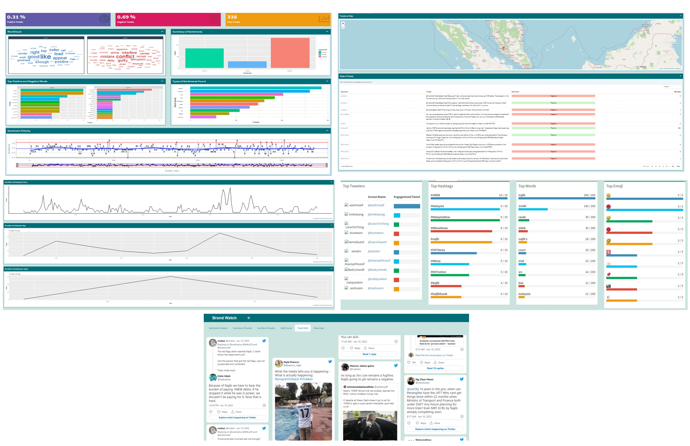

Brand Watch : Discover your online presence
====================================
author : Four Square
date: 31 May 2022
css: style.css

Group Members :
- Thayananth Kumaresan (U2105590)
- Samuel bin Douni @ Donny (U2000485)
- Nurul Jannah binti Ismail (U2000996)
- Arina Natasha binti Houri (U2000655)

Get to know Brand Watch
====================================
type: exclaim
left: 50%

### **Introducing,**
###### An all-in-one **Twitter sentiment** analysis app for monitoring your brand's reputation. 
###### Now you can:
- Extract customers' feelings and needs in relation to your marketing campaign
- Analyse your competitors by monitoring how customers talk about them
- Look out for opportunities to improve your own business

###### So, what are you waiting for? Make your data-driven decisions now, all at the tip of your finger!

***
#### **Problem Statement:**
###### Small businesses lack the resources to assess the marketability of their products.

#### **Questions proposed :**
1.  What is the public's opinion of a brand?
2. Which sentiment is most frequently expressed by customers toward a brand?
3.  What factors contribute to the customer's sentiment?

#### **Possible stakeholders:**
1. Brand Owners
2. Business Owners
3. Marketing Executive

Data Science Process
====================================
type: process
left: 50%

### **Asking Questions**

we determine problems that companies and brands can have and how we can solve and get answers for them using data science.

### **Finding data**

Getting access to the twitter API to retrieve data from Twitter

### **Getting data**

twitteR package is used to get a list of raw tweets from the Twitter API
Tweets are extracted based on user's input word or hashtag and input number of tweets wanted

### **Cleaning data**

the list of tweets is turned into a dataframe
URLs, links are removed and retweets aren't included for unique tweets

### **Analysing data**

function get_sentiments("bing") is used to determine the sentiment of the tweets by checking each words in it whether its positive or negative

### **Presenting data**

summary  of sentiments, positive and negative wordcloud, top positive and negative words, types of sentimetns found and sentiment polarity for the input word along with the documentation are presented in the Shiny App and published on RPubs

Description on datasets
====================================
left: 50%  
type: description

### **Dataset Used**  

- Twitter Web API. This API can be used to programmatically retrieve and analyze Twitter data, as well as build for the conversation on Twitter.

### **Explanation of the choice of the source data**  

- According to the kinsta.com website, Twitter found that 54% of users that have seen a brand mentioned in a Tweet take action, such as by visiting the company's website, searching for the brand, or retweeting company Tweets.  
- Twitter Web API you to find and retrieve, engage with, or create a variety of different resources including the features such as tweets, users, spaces, direct messages, lists, trends, media and places.
- Twitter Web API has four main objects: Tweets, Entities, Places, and Users which are essential for the various analysis in our dashboard.

  
====================================
title: FALSE
left: 60%
type: summary

### **Features of Our App**

######   • Sentiment Analysis  • Overview of Tweets
######   • Number of Tweets    • High Scores
######   • Tweet Wall          • Documentation
***
### **Our Precious Experience**
###### • It was an exciting journey to apply, test and learn Data Science & R knowledge.

###### •	We realized the importance of data and the power it holds.

###### •	We also enjoyed the collaborative effort we put into this project.

##### **Access our source code  here !**

##### **Access our Shiny App  here !**
 
##### [Access RPresentation here!](https://rpubs.com/ArinaNatasha/913841)

###  Thank you !

