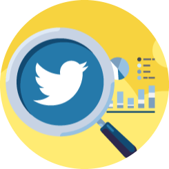

## **Documentation**

```{r, out.width = "50px", echo = FALSE}

```

### **Introducing,** *Brand Watch*

Brand Watch is an all-in-one Twitter-specific sentiment analysis app to discover your online presence. You can now extract customers' feelings, experiences, and needs in relation to your marketing campaign or even a new product release. Not only that, but you can also analyse your competition by monitoring how customers talk about them and looking for opportunities to improve your own business. Monitor your brand's reputation and make data-driven decisions, all at the tip of your finger!

#### **How to use this app?**

1.  Use the slider to determine the number of tweets to download.
2.  Key in your brand's associated keywords or hashtags[include'#'] to perform a search which will scrape all the tweets posted by users.
3.  Select a location from the dropdown to refine and filter your search by location.

#### **Our app features:**

1.  **Word cloud**
    -   A Word Cloud is a collection or cluster of words depicted in different sizes. The bigger and bolder the word appears, the more often it is appeared on the tweets.
2.  **Summary of Sentiments (bing implementation)**
    -   Here you will see summary of positive, neutral and negative words classified. With the use if bing lexicon it categorizes words in a binary fashion into positive and negative categories.
3.  **Top Positive & Negative Words**
    -   This plot shows the frequency of the positive and negative words used by the public towards your brand.
4.  **Types of Sentiments Found (NRC implementation)**
    -   The NRC Emotion Lexicon is a list of English words and their associations with eight basic emotions (anger, fear, anticipation, trust, surprise, sadness, joy, and disgust) and two sentiments (negative and positive). The annotations were manually done by crowdsourcing.
5.  **Sentiment Polarity**
    -   It is a scaling system that reflects the emotional depth of emotions in a piece of text. Sentiment score detects emotions and assigns them sentiment scores, for example, from 0 up to 10 - from the most negative to most positive sentiment. Sentiment score makes it simpler to understand how customers feel.
6.  **Tweets on Map**
    -   This provides the geolocation of where the tweets were created based on the location entered by the user.
7.  **Table of Tweets**
    -   It displays raw tweets as well as the number of retweets for keywords entered by users. By simply click on the column header, the table can be sorted.
8.  **Number of tweets per hour, day and week**
    -   It displays the number of tweets generated per hour, day, and week based on the keyword entered.
9.  **High Scores of top Tweeters, top Hashtags, top Word and top Emoji**
    -   It displays the highest scores in each category. Each category is created by:
        -   Top Tweeters: Weighted average of retweets count(2x) and favourite(1x) per tweet
        -   Top Hashtags: Most tweeted hashtags
        -   Top Words: Times of word was used
        -   Top Emoji: Times of emoji was used
10. **Tweet Wall**
    -   It displays the twitter with the exact Twitter UI to get a feel of a real tweet.
